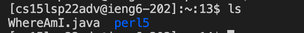

## Week 2 Lab Report

### Installing VSCode

Download VSCode for Mac and install it. The screenshot below shows the interface of VSCode after opening it.

### Remotely Connecting

First, install OpenSSH, lookup for CSE15L account and change the password of it. Then type in "ssh _<CSE15L-username>_@ieng6.ucsd.edu" in terminal and enter password. 

### Trying Some Commands

Try "ls" and "cd" commands. "ls" command gives us a list of subdirectories in the current directories; "cd" command change the directory.

### Moving Files with scp

Create a file on local computer (eg. WhereAmI.java). Run it using javac and java. Then, run "scp _<filename>_ _<CSE15L-username>_@ieng6.ucsd.edu:~/" command and enter the password. Then we could see the file on remote server.

### Setting an SSH Key
  
Run "ssh-keygen" on local computer. 
Generating public/private rsa key pair.
Enter file in which to save the key (/Users/<user-name>/.ssh/id_rsa): /Users/<user-name>/.ssh/id_rsa
Don't enter passphrase at this step.
Then on server, run "mkdir .ssh".
On local computer, run "scp /Users/<user-name>/.ssh/id_rsa.pub _<CSE15L-username>_@ieng6.ucsd.edu:~/.ssh/authorized_keys"
Then we will be able to "ssh" or "scp" without a password.

  
